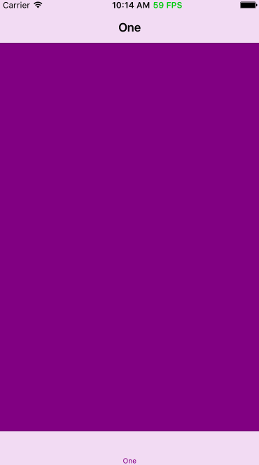

# LPFPS
iOS App FPS tracer and monitor that works in even different rootViewControllers

# Installation

- for < swift 3
`pod 'LPFPS', '~> 0.0.2'`

- for = swift 3
`pod 'LPFPS', '~> 1.0.0'`

# Usage

```swift
func application(application: UIApplication, didFinishLaunchingWithOptions launchOptions: [NSObject: AnyObject]?) -> Bool {
  /* initial your window
  window = UIWindow(frame: UIScreen.mainScreen().bounds)
  window?.rootViewController = yourRootViewController()
  window?.makeKeyAndVisible()
  */
  //start FPS 
  let kFPSIns = LPFPS.sharedFPS
  #if DEBUG
    kFPSIns.start()
  //#else
    //kFPSIns.stop()
  #endif
  return true
}
```
if you don't know how to define a DEBUG flag in Swift, this [post](http://litt1e-p.github.io/2016/06/03/swift-debug-flag/) will may do help

# Screenshot



# Release notes

- 0.0.2

`make class var public`

- 0.0.1

`origin version.`
